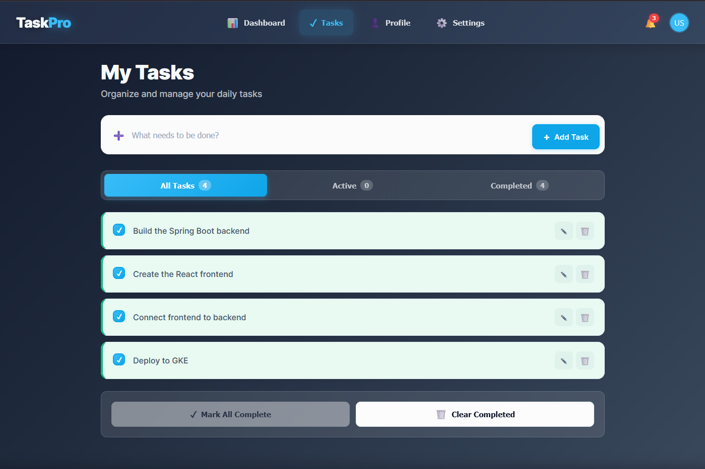

# 🚀 TaskPro – Cloud DevOps Deployment Project

TaskPro is a cloud-native full-stack web application deployed using modern DevOps practices on Google Cloud Platform (GCP).  
This project demonstrates end-to-end CI/CD automation, containerization, Kubernetes orchestration, cloud security, and monitoring following industry standards.

---

## 📌 Project Overview

TaskPro is a task management system built with:

- **Frontend:** React + Nginx  
- **Backend:** Spring Boot (REST API)  

The application is deployed across two production-grade environments:

- **Compute Engine (VM)** – Traditional container-based deployment
- **Google Kubernetes Engine (GKE)** – Scalable container orchestration

All deployments are automated using **GitHub Actions**, and system observability is achieved using **Prometheus and Grafana**.

---

## 🖥️ Application User Interface

### Task Management View

### Dashboard Overview

> 📌 *These screenshots demonstrate the live TaskPro user interface deployed on cloud infrastructure.*

---

## 🌐 Live Environments

| Environment | URL |
|------------|-----|
| Production (VM) | https://taskpro-gehan.me |
| Kubernetes (GKE) | https://taskprogehan.app |
| Grafana Dashboard | http://grafana.taskpro-gehan.me:3000 |
| Prometheus Metrics | http://grafana.taskpro-gehan.me:9090 |
| Node Exporter | http://grafana.taskpro-gehan.me:9100/metrics |

---

## 🎯 Project Objectives

- Implement a complete CI/CD pipeline using GitHub Actions
- Containerize applications using Docker
- Deploy services using Kubernetes (GKE)
- Secure applications with HTTPS and managed SSL
- Enable monitoring and observability
- Demonstrate real-world DevOps workflows

---

## 🧰 Technology Stack

| Category | Tool / Technology |
|--------|------------------|
| Source Control | GitHub |
| CI/CD | GitHub Actions |
| Containerization | Docker |
| Orchestration | Kubernetes (GKE) |
| Cloud Provider | Google Cloud Platform |
| Web Server | Nginx |
| Monitoring | Prometheus, Grafana |
| Security | HTTPS, GCP Load Balancer, Managed Certificates |

---

## 🔄 CI/CD Workflow

1. Developer pushes code to GitHub  
2. GitHub Actions pipeline is triggered  
3. Docker images are built automatically  
4. Images are pushed to Docker Hub  
5. Applications are deployed to:
   - Compute Engine (VM) using Docker Compose
   - Google Kubernetes Engine using Kubernetes manifests  
6. Monitoring continuously tracks system health

---

## 🏗️ Deployment Architecture

### 1️⃣ VM Deployment (Compute Engine)

- Docker Compose runs:
  - React frontend
  - Spring Boot backend
  - Nginx reverse proxy
- GCP Load Balancer handles HTTPS traffic
- Prometheus and Grafana monitor application and VM metrics

### 2️⃣ Kubernetes Deployment (GKE)

- Kubernetes Deployments for frontend and backend
- ClusterIP services expose pods internally
- GKE Ingress with ManagedCertificate provides HTTPS
- Auto-scaling and self-healing enabled

---

## 📊 Monitoring & Observability

- **Prometheus** collects application and system metrics
- **Node Exporter** provides VM-level metrics
- **Grafana** visualizes:
  - JVM metrics
  - CPU and memory usage
  - Application health
- Enables proactive monitoring and troubleshooting

---

## 🧠 Conclusion

TaskPro represents a **complete, industry-aligned DevOps implementation** that mirrors real-world production systems used in modern software organizations.

By combining **Docker-based containerization**, **GitHub Actions CI/CD automation**, and **Google Cloud infrastructure**, the project demonstrates how applications can be built, tested, deployed, and monitored with minimal manual intervention. The hybrid deployment approach—using both **Compute Engine** and **Google Kubernetes Engine**—highlights the flexibility of cloud-native architectures and the benefits of Kubernetes in terms of scalability, resilience, and maintainability.

The integration of **Prometheus and Grafana** adds a strong observability layer, enabling continuous monitoring, performance analysis, and proactive issue detection. Security best practices such as **HTTPS, managed SSL certificates, and load-balanced traffic routing** further reinforce the production readiness of the system.

Overall, TaskPro serves not only as a functional task management application but also as a **reference DevOps blueprint**—demonstrating best practices in CI/CD, cloud deployment, monitoring, and operational excellence suitable for enterprise-grade environments.

---
